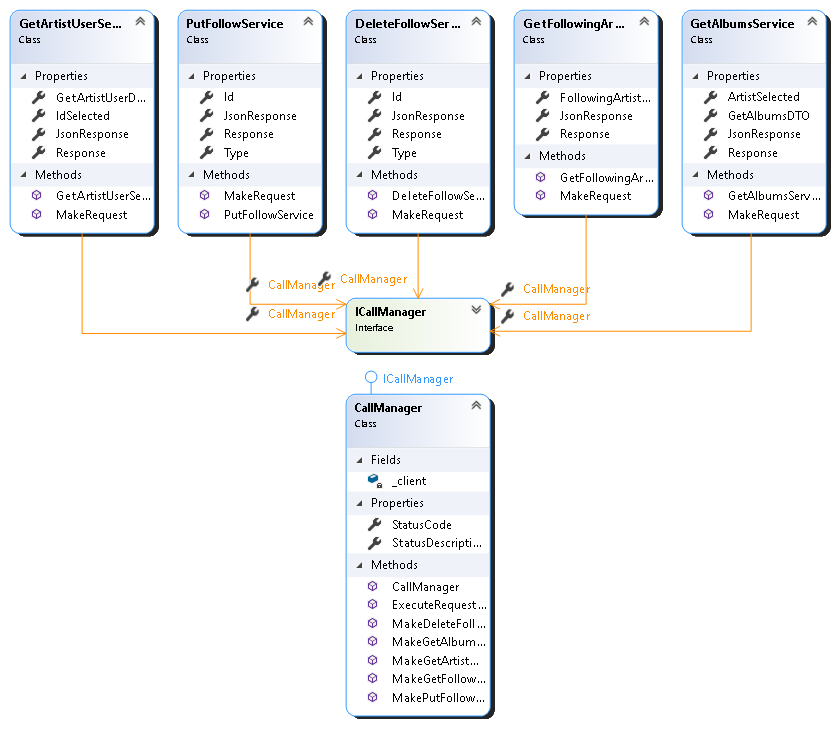
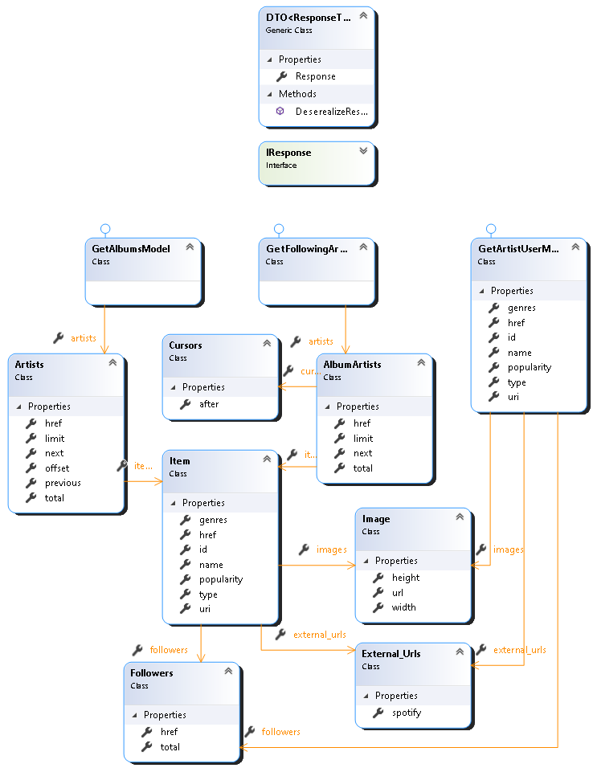
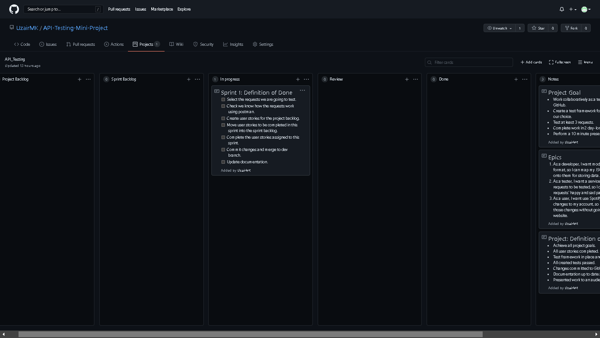
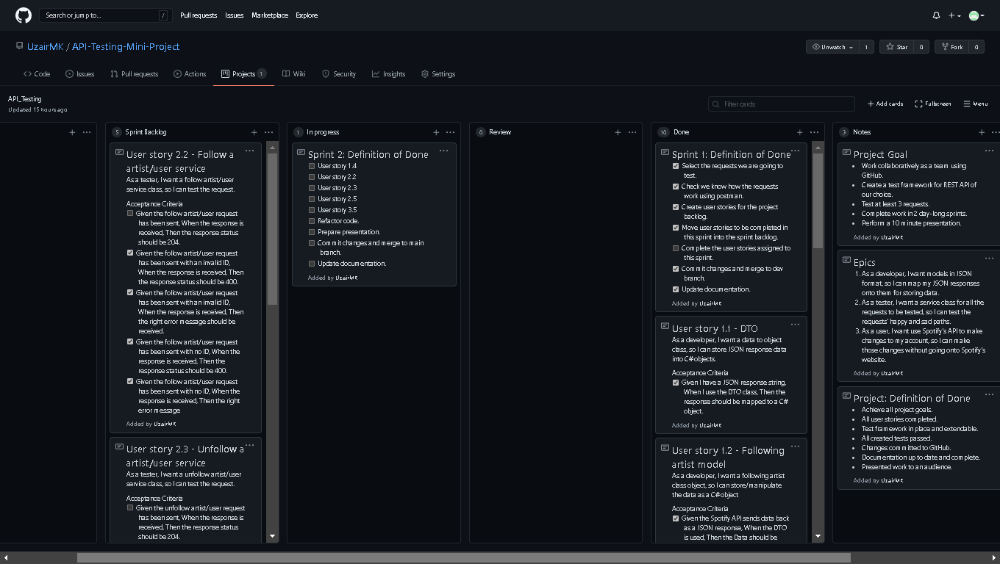

# API Testing Mini Project

## Project Aims

The aim of this project is to choose an API and test it using RestSharp in Visual Studio as a team of three. The testing framework should be designed well and easily extendible. The API we have chosen is the Spotify API. 

## Project Goals

- Work collaboratively as a team using GitHub.
- Create a test framework for REST API of our choice.
- Test at least 3 requests.
- Complete work in 2 day-long sprints.
- Perform a 10 minute presentation.

## Project: Definition of Done

- Achieve all project goals.
- All user stories completed.
- Test framework in place and extendable.
- All created tests passed.
- Changes committed to GitHub.
- Documentation up to date and complete.
- Presented work to an audience.

## Class Diagrams

​	Below are images of the class diagrams. There is a class diagram for the services and a class diagram for the models that the JSON responses were stored in.

### Services Class Diagram

### Model Class Diagrams

## Epics

1. As a developer, I want models in JSON format, so I can map my JSON responses onto them for storing data.
2. As a tester, I want a service class for all the requests to be tested, so I can test the requests' happy and sad paths.
3. As a user, I want use Spotify's API to make changes to my account, so I can make those changes without going onto Spotify's website.

## Sprints

### Sprint 1

#### Kanban Board at the beginning

#### Sprint Goals

​	The API we have selected to test is the Spotify API. The goal of the first sprint is to select which requests we would like to test because because there are a lot of requests to choose from. While selecting the requests we will also you use Postman to make sure we know how the request works. After confirming the requests we are going to test we will build up the project's backlog and move whatever we aim to finish in this sprint to the sprint backlog.

​	In terms of blockers, we have two. The first one is the team lacks experience using GitHub collaboratively so this will slow down the pace of work and the second one is that one of the group members does not use Spotify and therefore is not aware of how the application is used.

#### Sprint 1: Definition of done

- [x] Select the requests we are going to test.
- [x] Check we know how the requests work using Postman.
- [x] Create user stories for the project backlog.
- [x] Move user stories to be completed in this sprint into the sprint backlog.
- [ ] Complete the user stories assigned to this sprint.
- [x] Commit changes and merge to dev branch.
- [x] Update documentation.

#### Kanban Board at the end

#### Sprint Review

​	The requests we have chosen to test are get artist/user, follow artist/user, unfollow artist/user, get following artists, and get albums. We understand how they work from practice with Postman. The requests we chosen to work on during this sprint are get artist/user, follow artist/user, unfollow artist/user, and get following artists. We completed the model and services for these requests and almost finished the tests.

​	Unfortunately we were unable to finish all the user stories assigned to this sprint and this is because we could not come up with a way to test the happy path of follow and unfollow artist/user requests. The reason for this is that when these requests are successful they return no content which is throwing an error in the code. We aim to fix this in the next sprint.

​	It is a good thing we took our blockers into consideration and did not overload ourselves with too much work. We manage to complete 9 out of 11 of the assigned user stories which is not bad. One of the reasons why we didn't manage to finish all the user stories is because the access token we were getting from Spotify kept expiring, slowing down our workflow.

#### Sprint Retrospective

​	The biggest lesson we learnt today is not to make frequent pull requests to the dev branch because this is time consuming and most the pull requests are not necessary. Also when the group is collating their work, small errors should be fixed on one machine instead of having the person responsible for that file fixing the problem on their machine and making another pull request because, again, this is time consuming with no benefit.

### Sprint 2

#### Kanban Board at the beginning

#### Sprint Goals

​	This is the final sprint. The goal of this sprint is to fix the error we were having with user stories 2.2 and 2.3 due to a "No Content" response. We will then implement the remaining request we are going to test which is the get albums request.

​	After all the feature are in place and working, we will then refactor the code and make it easier to add more functionality in case anyone wants to continue the work we have done. Then will we create a presentation for tomorrow.

​	In terms of blockers, apart from the access token expiring, one of our group members has a personal commitment he has to attend to which will mean he is unavailable to work for 2 hours.

#### Sprint 2: Definition of done

- [x] User story 1.4
- [x] User story 2.2
- [x] User story 2.3
- [x] User story 2.5
- [x] User story 3.5
- [x] Refactor code.
- [x] Prepare presentation.
- [x] Commit changes and merge to main branch.
- [x] Update documentation.

#### Kanban Board at the end

#### Sprint Review

#### Sprint Retrospective

### Project Retrospective

#### What We Have Learnt

#### What We Would Do Differently Next Time

#### Further Improvements

- 

### How To Extend Functionality

