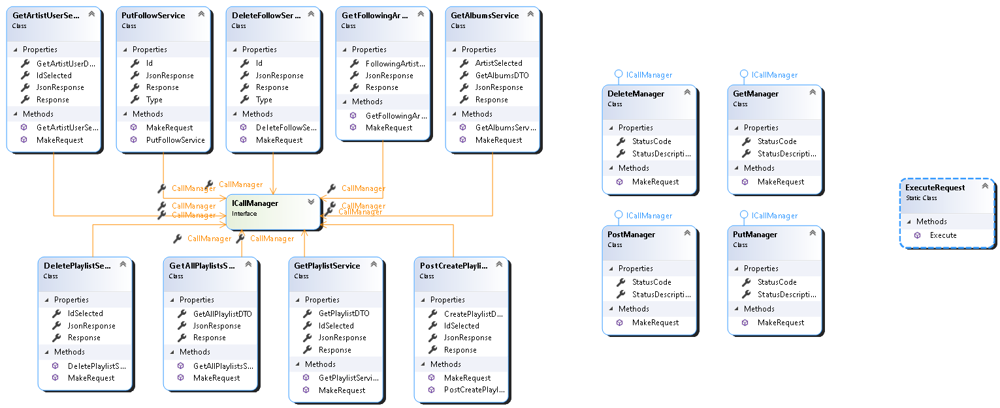
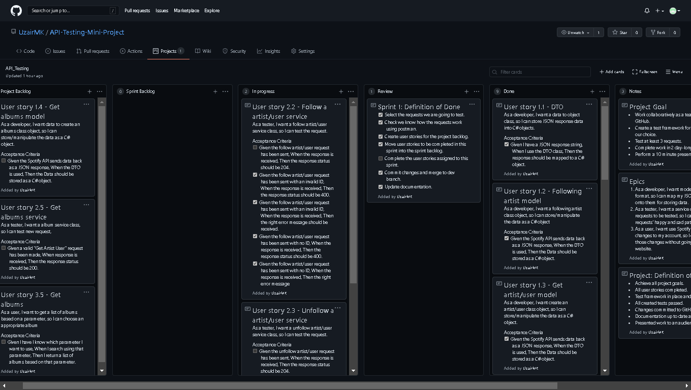
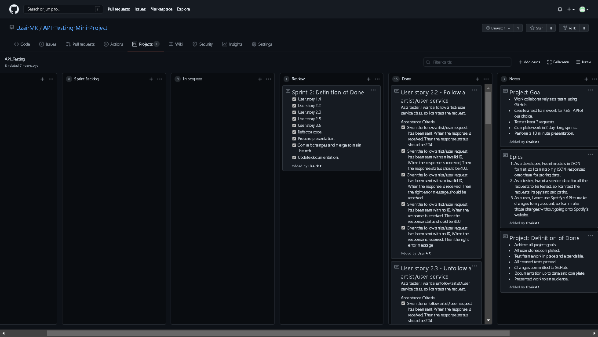

# API Testing Mini Project

## Project Aims

The aim of this project is to choose an API and test it using RestSharp in Visual Studio as a team of three. The testing framework should be designed well and easily extendible. The API we have chosen is the Spotify API. 


## Project Goals

- Work collaboratively as a team using GitHub.
- Create a test framework for REST API of our choice.
- Test at least 3 requests.
- Complete work in 2 day-long sprints.
- Perform a 10 minute presentation.


## Project: Definition of Done

- Achieve all project goals.
- All user stories completed.
- Test framework in place and extendable.
- All created tests passed.
- Changes committed to GitHub.
- Documentation up to date and complete.
- Presented work to an audience.


## Class Diagrams

​	Below are images of the class diagrams. There is a class diagram for the services and a class diagram for some of the models that the JSON responses were stored in.

### Services Class Diagram



### Model Class Diagrams


## Epics

1. As a developer, I want models in JSON format, so I can map my JSON responses onto them for storing data.
2. As a tester, I want a service class for all the requests to be tested, so I can test the requests' happy and sad paths.
3. As a user, I want use Spotify's API to make changes to my account, so I can make those changes without going onto Spotify's website.


## Sprints

### Sprint 1

#### Kanban Board at the beginning


#### Sprint Goals

​	The API we have selected to test is the Spotify API. The goal of the first sprint is to select which requests we would like to test because because there are a lot of requests to choose from. While selecting the requests we will also use Postman to make sure we know how the request works. After confirming the requests we are going to test we will build up the project's backlog and move whatever we aim to finish in this sprint to the sprint backlog.

​	In terms of blockers, we have two. The first one is, the team lacks experience using GitHub collaboratively so this will slow down the pace of work and the second one is that one of the group members does not use Spotify and therefore is not aware of how the application is used.

#### Sprint 1: Definition of done

- [x] Select the requests we are going to test.
- [x] Check we know how the requests work using Postman.
- [x] Create user stories for the project backlog.
- [x] Move user stories to be completed in this sprint into the sprint backlog.
- [ ] Complete the user stories assigned to this sprint.
- [x] Commit changes and merge to dev branch.
- [x] Update documentation.

#### Kanban Board at the end



#### Sprint Review

​	The requests we have chosen to test are get artist/user, follow artist/user, unfollow artist/user, get following artists, and get albums. We understand how they work from practice with Postman. The requests we chosen to work on during this sprint are get artist/user, follow artist/user, unfollow artist/user, and get following artists. We completed the model and services for these requests and almost finished the tests.

​	Unfortunately we were unable to finish all the user stories assigned to this sprint and this is because we could not come up with a way to test the happy path of follow and unfollow artist/user requests. The reason for this is that when these requests are successful they return no content which is throwing an error in the code. We aim to fix this in the next sprint.

​	It is a good thing we took our blockers into consideration and did not overload ourselves with too much work. We manage to complete 9 out of 11 of the assigned user stories which is not bad. One of the reasons why we didn't manage to finish all the user stories is because the access token we were getting from Spotify kept expiring, slowing down our workflow.

#### Sprint Retrospective

​	The biggest lesson we learnt today is not to make frequent pull requests to the dev branch because this is time consuming and most the pull requests were not necessary. Also when the group is collating their work, small errors should be fixed on one machine instead of having the person responsible for that file fixing the problem on their machine and making another pull request because, again, this is time consuming with no benefit.

### Sprint 2

#### Kanban Board at the beginning


#### Sprint Goals

​	This is the final sprint. The goal of this sprint is to fix the error we were having with user stories 2.2 and 2.3 due to a "No Content" response. We will then implement the remaining request we are going to test which is the get albums request.

​	After all the feature are in place and working, we will then refactor the code and make it easier to add more functionality in case anyone wants to continue the work we have done. Then will we create a presentation for tomorrow.

​	In terms of blockers, apart from the access token expiring, one of our group members has a personal commitment he has to attend to which will mean he is unavailable to work for 2 hours.

#### Sprint 2: Definition of done

- [x] User story 1.4
- [x] User story 2.2
- [x] User story 2.3
- [x] User story 2.5
- [x] User story 3.5
- [x] Refactor code.
- [x] Prepare presentation.
- [x] Commit changes and merge to main branch.
- [x] Update documentation.

#### Kanban Board at the end



#### Sprint Review

​	This sprint went smoothly. We finished all the work we assigned to the sprint and have a presentation ready for tomorrow.

​	The "No Content" response problem was solved using a try-catch block on the JObject because it was the one throwing an error due to there being no content to parse.

​	We refactored the way we sent and received requests by breaking up the call manager into the different request type managers and moving code around. Now it is very easy to add new requests, all one has to do is make a new service class for the request they want to test.

#### Sprint Retrospective

​	Although the presentation was ready we did not do a dry run through it to make sure we are happy with the content we are going to present and  the way we are going to present it. It would have been nice to set some time aside to do this. Instead we are now going to meet together 1 hour before the presentation to practice and make any final changes.


## Project Retrospective

### What We Have Learnt

​	This project has opened our eyes to many things in this section of the retrospective we plan to discuss the most important / relevant lessons learnt during this small group project.

​	Most prevalent skill learnt was using GitHub collaboratively . We have gained experience with GitHub for our own singular projects so we knew, so we had an inkling of what to expect going into it which gave us a head start but using it collaboratively raised its own issues. A main issue we had was attempting too many pull requests unnecessarily, the issue with this is that it is very time consuming, time that would be better spent creating new tests or methods etc.

​	The next thing we learnt was that small errors should be handled there and then instead of delegating it to the person who made the error. This, like the pull request, is time consuming. If the error is small that can be fixed in one or two lines it will take a long time for the error spotter to contact the error maker, tell them the error, get them to fix it, then create a pull request. The whole cycle just lacks efficiency and goes around in an unnecessary circle.

​	Other than the aforementioned lessons learnt, we have gained a deeper understanding of the tools and concepts we have learnt. Tools in this case being, Postman which is used for API development and Spotify the program we created the API based off, and concepts in this place meaning the creation of service layers, independency injections, and service layer testing. The use of all of these tools and concepts have improved significantly for all members of our group through using them.

### What We Would Do Differently Next Time

​	Although this project was done well there are a few things could do differently to get the same or better results so in this section I am going to go through them.

​	To start with if we were to do anything differently it would be to stop the unnecessary pull request therefore opening up more time for us to work on other parts of the program. 

​	The next thing we could change would be the amount of functionality we added. that being said the only reason the functionality was limited was because of time constraints.

​	The final thing we could do differently would he to choose a whole different API, Spotify was fun to work with but there would be no gain in doing it again.

### Further Improvements

​	Our project is good but not perfect (obviously) so here are a list of things we could have done to make it better:

- Create much more functionality
- Add good looking UI for customer interaction
- Add a few more Tests


## How To Use

​	Simply create an instance of a service class whose request you want to test and call the service class's `MakeRequest` method. After the method has been called with whatever parameters you put into the method, the service class will store the response. The `CallManager` variable contains the status code and description , the `JsonResponse` variable  contains the JSON response from the request in the form of a JObject, the `Response` variable contains the JSON response as a string and if the service class has a DTO variable, it contains the JSON response mapped onto C# classes. These variables can be used to test the API's responses.


## How To Extend Functionality

### Adding other requests (services)

​	If one want to test other requests the Spotify API has to offer there is a "TemplateService" class for you to duplicate and edit, to preform other requests. In the duplicated template, rename the class and constructor appropriately. Uncomment the line in the constructor and make sure the `CallManager` is assigned the right manager depending on the request type (e.g. GET requests should use the `GetManager`, DELETE requests should use the `DeleteManager`, ...). In the `MakeRequest` method, type the resource the request uses into the resource string (the resource is the part of the request that comes after https://api.spotify.com/). If there are changeable parameters in the resource, you can add them to the method's parameters and have the method's parameters be concatenated into the right place on the resource string. Finally, if you would like to store the parameters you used when you called the `MakeRequest` method, feel free to make properties with the other properties and assign the parameter values to those properties in the method. Use the other service classes as examples if you get stuck following these instructions.

### Required manager not available

​	If the manager for the type of request you are making is not available, just duplicate the `GetManager`, rename (file name and class name) it appropriately and change the "GET" on line 12 where is says 

```c#
var request = new RestRequest(Method.GET)
```

to the request type needed.

### Model for DTO

​	If you want to make use of the DTO class to map your JSON response to C# classes, make sure you have C# classes that follow the structure and naming of the JSON response in the same namespace. You can add your model with the other models in the "Model.cs" file. Just make sure the root object inherits the `IResponse` interface, any duplicate classes are removed and if two classes have the same name but are different, rename one of them, also making sure you rename variable data types where that class was used.
